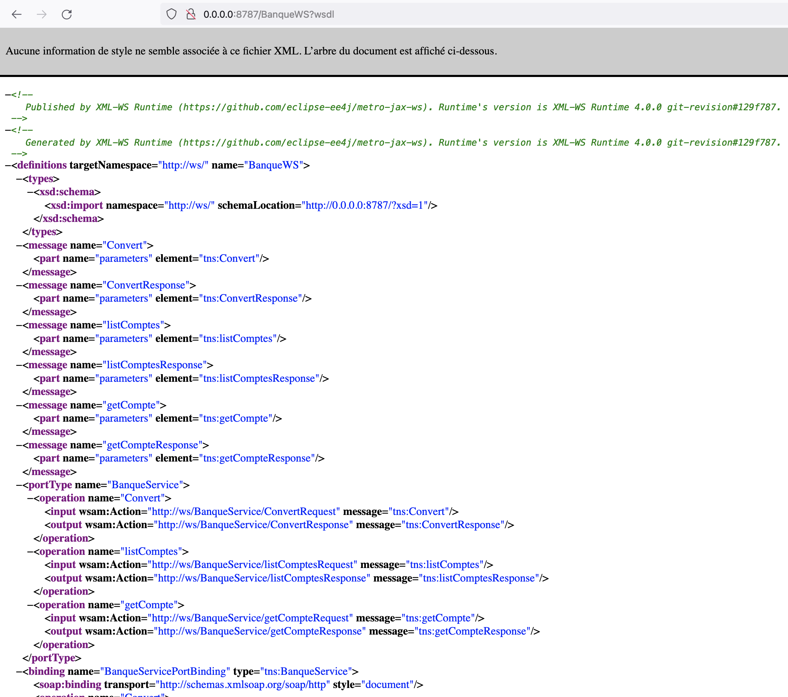
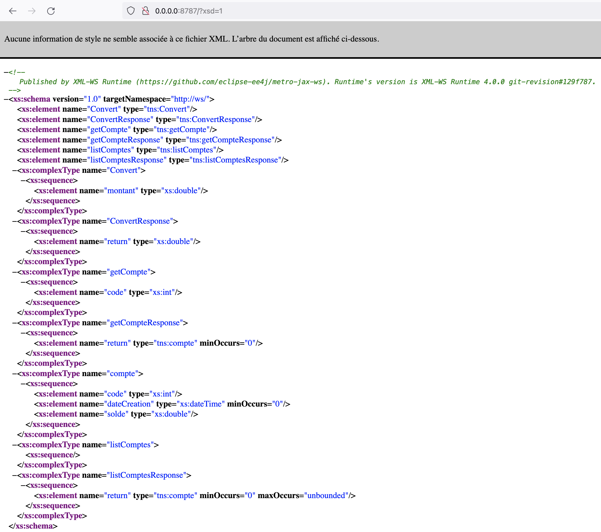
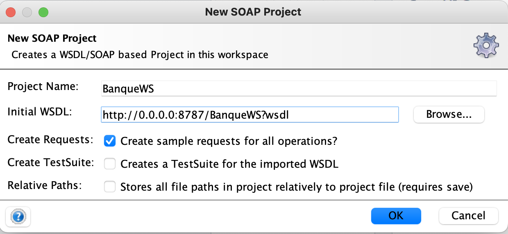
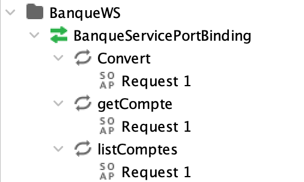
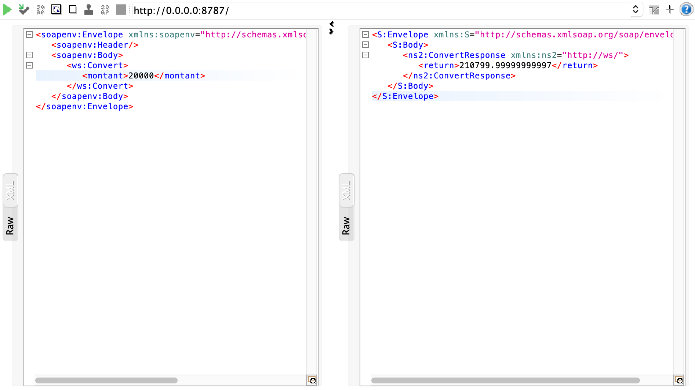
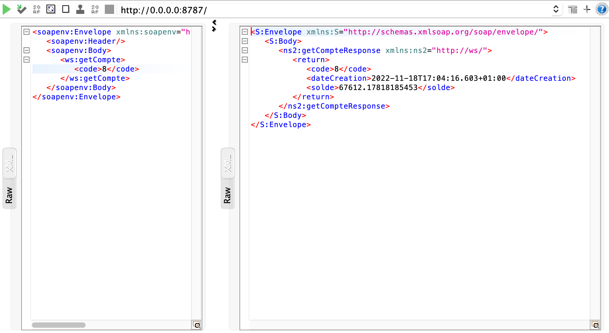
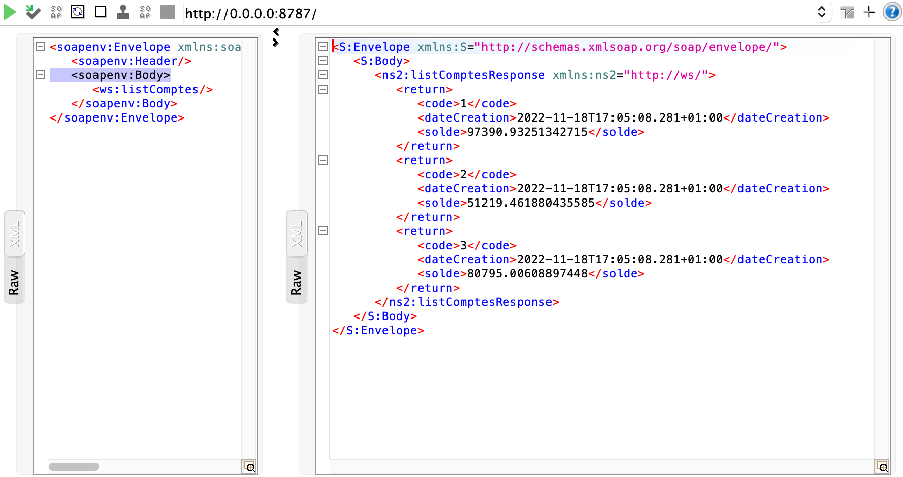
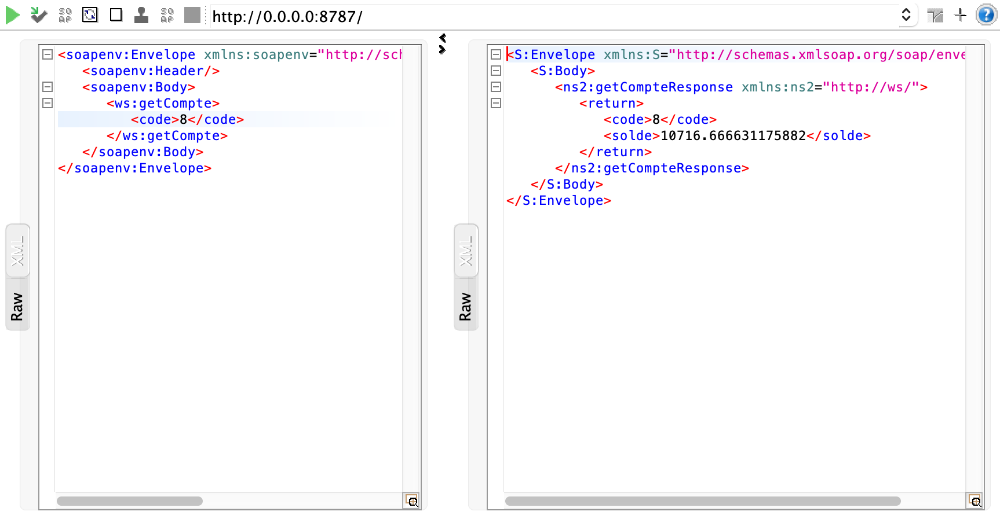

<h1>Java Webservice Tutorial</h1>
<h3>wsdl file screenshot</h3>

  

<h3>schema screenshot</h3>

  

<h3>Webservice consumption with SoapUI</h3>
<h5>Project Creation with SoapUI</h5>

 
<h5>List of available operations</h5>

 
<h5>Make use of the conversion method</h5>

 
<h5>Make use of the getCompte method</h5>

 
<h5>Make use of the listComptes method</h5>

 
<h5>getCompte operation with dateCreation attribute removed</h5>

 
